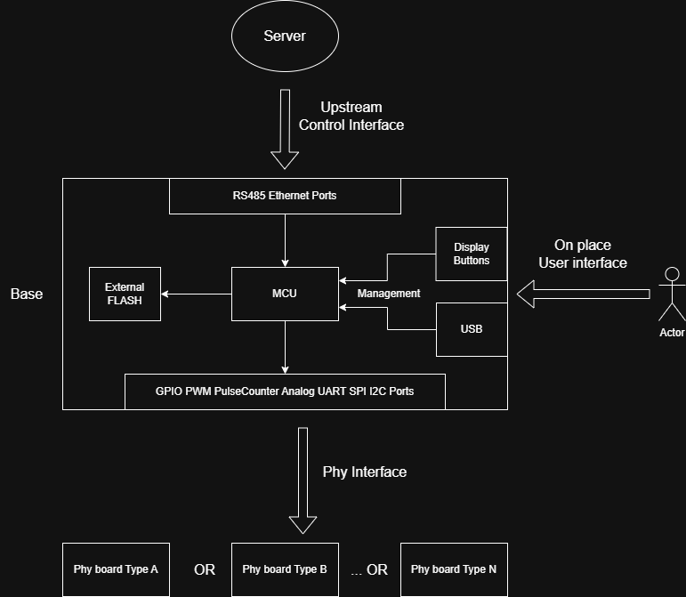
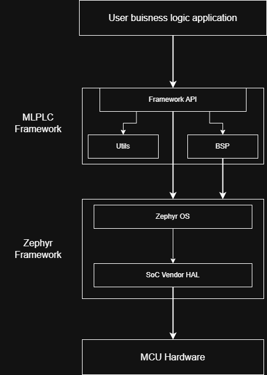

# MLPLC

Modular Low-level Programmable Logic Controller.

Программный фреймворк и набор модульных устройств для создания типовых embedded проектов.

Проект обеспечивает:
- простое, безопасное и производительное программирование бизнес-логики, минимум технического кода;
- сборку одного и того же исходного кода под разные устройства;
- проверенную **аппаратурную базу** с типовыми интерфейсами управления, портами для подключения проект-специфичных расширений;
- защищенное обновление прошивки по имеющимся интерфейсам.

## Обоснование разработки и назначение

В большинстве маленьких и средних embedded проектах бОльшая часть кода - это **технический** код: работа с аппаратными ресурсами микроконтроллера, подключение/написание middle-wire библиотек для работы с интерфейсами, файловой системой, внешними чипами.  
Бизнес-логика проекта, как правило, наоборот сравнительно проста - реагирование на входные сигналы, сбор, обработка и отправка данных с датчиков, управление выходными сигналами через upstream интерфейсы.  
Соответственно, требования к аппаратной части проекта однотипны: цифровые порты ввода/вывода, аналоговые порты ввода/вывода, счетчики импульсов, цифровые интерфейсы датчиков и других чипов - **UART**, **I2C**, **SPI**, upstream интерфейсы управления - **RS485**, **ETHERNET**.  
Поэтому, бОльшая часть ошибок сосредотачивается именно в **технической** части проекта, которая в большинстве случаев однотипна.

Данный проект призван сократить количество ошибок и снизить порог входа при разработке устройства путем включения в себя общей, типовой части embedded проекта и гарантируя её работоспособность.

## Дизайн

### Аппаратная часть

С точки зрения аппаратуры данный проект - это **база**, **аппаратная база**: микроконтроллер и обвязка, upstream интерфейсы, опционально какой-либо вид user-интерфейса. Фактически **база** будет выполнена в виде отдельной платы, к которой можно подключать платы **физики** - проект-специфичные платы, где будут расположены непосредственно силовые порты/сенсоры. Конкретный функционал плат см: набор плат [баз](board-base), набор плат [физики](board-phy).

Структурная схема:



*__У конкретных моделей базовой платы набор интерфейсов может отличаться__*

### Программный фреймворк

На данный момент существуют фреймворки для обеспечения универсального высокоуровневого доступа к периферии микроконтроллера: `mbed-os`, `zephyr-os` и другие, для данного проекта взят за основу [zephyr](https://github.com/zephyrproject-rtos/zephyr), потому что он обеспечивает наиболее полный доступ к периферии и активно развивается.

Но, тем не менее, за счет своей универсальности `zephyr` имеет достаточно громоздкий интерфейс, поэтому, в рамках данного проекта разработан простой `modern-safe-c++` API к `zephyr` с учетом типовых embedded потребностей.  

Данный проект требует `board support package`(`BSP`) для каждой **базы**, который включает в себя маппинг аппаратуры - `.dts.overlay` файлы, платформно-зависимый код.

Также в embedded проектах требуются типовые, как правило кросс-платформенные утилиты и алгоритмы, например: текстовое меню, библиотеки обработки сигналов и др. Эти библиотеки включаются во фреймворк как `utils`.



#### MLPLC Framework API

API должен обеспечивать уникальный доступ к аппаратуре - одновременно может существовать только один объект для представления той или иной периферии.  
Например, для работы с `GPIO 0` API выдает объект порта `DigitalInput`, при повторной попытке запроса этого порта API должен выдать ошибку, так, пока предыдущий объект не будет разрушен.

API должен быть `thread-safe` - каждый публичный метод объекта, работающий с периферией или влияющий на её работу должен быть обернут в мьютекс.

Оба вышеизложенных правила обеспечивает невозможность ситуации двойного одновременного доступа к периферии.

API должен быть высокоуровневым.  
Маппинг GPIO и интерфейсов должен привязываться к распиновке порта физики, а не к порту МК, т.к. на разных базах порт МК может меняться, а для совместимости итоговую роль играет именно номер пина на разъеме физики.  
При разработке более "простых" плат баз необходимо в первую очередь реализовывать GPIO и интерфейсы для порта физики начинающиеся с нуля. Таким образом, при разработке платы физики необходимо использовать GPIO и интерфейсы в порядке возрастания для большей совместимости.

Работа с фреймворком осуществляется путем создания объектов определенных API классов, например `DigitalInput`.

Фреймворк не использует механизм исключений.  
Поэтому, объекты API классов нельзя создавать напрямую, через конструктор, т.е. конструктор приватный.  
Вместо этого создание происходит с помощью статического метода `new_shared()` или `new_unique()`, по типу:
```
auto new_shared(...) -> std::expected<ClassName, Error> {...}
```
Внутри которого уже вызывается приватный конструктор, методы инициализации, которые потенциально могут завершиться с ошибкой.  
Такой подход используется для снижения нагрузки на runtime и менее громоздкой обработки ошибок.

Проверка на предмет того, что запрашиваемая периферия уже занята - еще существует ранее выделенный объект, ложится на процедуру создания объекта описанную выше.  
Данные о наличии таких объектов хранятся в статических полях класса.

Классы для работы с периферией:
|Класс|Занимаемая периферия|Требования|
|---|---|---|
|DigitalInput|GPIO пин|Чтение текущего уровня на пине. <br>Чтение текущего уровня на пине с механизмом debounce. <br> Настройка параметров механизма debounce.<br>Debounce механизм не должен блокировать поток на время определения уровня, т.е. сам механизм должен выполняться в фоне.|
|DigitalOutput|GPIO пин|Установление уровня на пине. <br>Настройка типа выхода - `push-pull`/`open-drain`. <br>Программная генерация импульсов низкой частоты с возможностью настройки частоты, скважности и количества импульсов. <br>Программная генерация импульсов не должна блокировать поток, т.е. сам алгоритм должен выполняться в фоне.|
|AnalogInput|Канал ADC, GPIO пины|Разовое преобразование на одном канале. <br>Возможность настройки канала в дифференциальный режим. <br>Настройка разрядности. <br>Настройка программного oversampling(усреднения). <br>Возможность получать значение в вольтах.|
|AnalogGroup|Каналы ADC, GPIO пины|<br>Разовое преобразование группы каналов. <br>Серия преобразований группы каналов. <br>Бесконечное преобразование группы каналов. <br>Возможность настройки каналов в дифференциальном режим. <br>Настройка частоты дискретизации. <br>Настройка разрядности. <br>Настройка аппаратного oversampling.|
|PwmGroup|Таймер, GPIO пины|Включение/выключение генерации ШИМ на канале. <br>Установка скважности на канале. <br>Установка частоты ШИМ на всей группе каналов. <br>Возможность представления каналов отдельными объектами.|
|PulseCounter|GPIO пин, опционально таймер|Получение количества насчитанных импульсов. <br>Обнуление счетчика. <br>Настройка типа счетчика: программный, по прерываниям, на базе аппаратного таймера/счетчика. <br>Настройка фронта счета. <br>Настройка debounce механизма для программного типа счетчика.|
|Serial|UART, GPIO пины|Чтение буферизованных принятых байт. <br>Запись байт в буфер на передачу. <br>Настройка скорости, количества бит в кадре(8 или 9).|
|I2c|I2C, GPIO пины|Только режим мастера. <br>настройка частоты шины. <br>Представление устройств на шине отдельными объектами. <br>Объекты устройств могут быть двух классов: <br>`I2cSimpleDev` - для одно-регистровых устройств; <br>`I2cDev` - для обычных устройств, поддерживающих адресацию регистров. |
|Spi|SPI, GPIO пины|Поддержка режимов: transmit-only, receive-only, full-duplex, quad-spi. <br> Настройка параметров сигнала: частота, полярность, фронт защелки. <br>Прием-передача буфера байт.|
|Rtc|RTC|Установка текущего времени. <br>Получение текущего времени.|
|AcDimmerGroup|GPIO пины, опционально таймер|Управление нагрузкой с синхронизацией перехода через ноль питающего напряжения. <br>Включение/выключение диммирования на каналах. <br>Установка скважности на канале. <br>Возможность представления каналов отдельными объектами. <br>Два режима работы: по прерываниям или на базе таймера. <br><br>По прерываниям - дискретность диммирования 1 период, т.е. период сигнала либо полностью пропускается, либо полностью не пропускается, скважность определяется соотношением количества пропускаемых периодов к не пропускаемым. <br><br>На базе таймера - дискретность ~ 1/65536 периода, т.е. диммируется каждый период в отдельности. По сути это ШИМ, синхронизированный с переходом через ноль. Данный режим имеет большую частоту переключений и больше подходит для диммирования, например, освещения|
|AdDigitalOutputGroup|GPIO пины|Управление нагрузкой с синхронизацией перехода через ноль питающего напряжения. Работает аналогично `DigitalOutput`, но реальное переключение уровня на выходе происходит при детектировании нуля.|

Системные классы и функции:
|Класс|Описание|
|---|---|
|Thread|Создание объекта класса означает создание нового системного потока. <br>Подобно `std::thread`.|
|Mutex|C++ обертка для zephyr мьютекса. <br>Подобно `std::mutex`.|
|TcpListener|Класс для работы с TCP сокетом в режиме сервера.|
|TcpStream|Класс для работы с TCP сокетом в режиме клиента.|
|UdpListener|Класс для работы с UDP сокетом в режиме сервера.|
|UdpStream|Класс для работы с UDP сокетом в режиме клиента.|
|File|Открыть файл в файловой системе по указанному пути. <br>Подобно `std::fstream`.|
|Directory|Открыть директорию в файловой системе по указанному пути. <br>Создание директории. <br>Функция `ls()` - получение списка элементов(`Entry`) в директории. <br>Функция `cd()` - смена директории.|

|Функция|Описание|
|---|---|
|sleep()|Системная задержка выполнения текущего потока, подобно `std::this_thread::sleep()`.|
|ls()|Получить список файлов и директорий по указанному пути.|
|create_dir()|Создать директорию по указанному пути.|
|is_exists()|Проверяет, существует ли файл/директория по указанному пути.|

Прикладные классы и функции:
|Класс|Занимаемая периферия|Описание|
|---|---|---|
|Mcumenu|Зависит от реализации драйвера в BSP|Создание объекта `Mcumenu` с драйвером, использующим функционал BSP DISPLAY_BUTTON_MENU|
|ModbusSlave|UART, GPIO пины, Net socket|C++ обертка для `zephyr-modbus-slave`. <br>Режимы работы: RTU, ASCII, TCP. <br>Возможность одновременной работы RTU/ASCII режима совместно с TCP на одной карте регистров. <br>Удобное представление карты регистров: коллбек чтения элемента карты регистров, `is_changed()` метод для проверки на то, что данные в определенных регистрах были изменены.|
|ModbusRtuMaster|UART, GPIO пины|C++ обертка для `zephyr-modbus-master`.|
|Sensor|Зависит от типа сенсора|C++ обертка для `zephyr-sensor`. <br>Ноды описывающие сенсор необходимо добавлять вручную в DTS overlay.|

|Функция|Описание|
|---|---|
|board_info()|Информация о базовой плате, о подключенных платах физики, приватные данные из внутренней памяти плат физики.|

## Use-case

### Измеритель переменного тока и напряжения

3-х фазный измеритель тока и напряжения(4 сенсора тока, 3 сенсора напряжения).  
Максимальный измеряемый ток 25А.  
Погрешность измерения тока +-10mA.  
Непрерывное измерение с частотой дискретизации 10кГц для расчета потребления мощности и отправки выборок на сервер для более детального анализа.  
Длина непрерывной выборки для отправки на сервер - 20 периодов или 4000 точек(суммарно с 7-ми каналов 28к точек или 56кБ).

Требования к базовой плате:
|RAM для бизнес-логики|Upstream интерфейсы|User интерфейсы|Порт физики|
|---|---|---|---|
|200KB|Modbus-RTU для снятие показаний<br><br>Ethernet для отправки выборок|Display-Button меню для отображения показаний и настройки|7 дифференциальных каналов АЦП разрядностью 13+ эффективных бит, с частотой дискретизации 10кГц на каждый<br><br>Возможность считывать коэффициенты калибровки с платы физики<br><br>Возможность получать питание с платы физики|

### Контроллер АВД

Блок управления насосным оборудованием высокого давления. Расчитан на подключение до 4 клапанов и до 2 дозирующих насосов ULKA.
Питание от переменного тока AC 24В 50Гц, изменение состояний при переходе через ноль. Дозация с дискретностью 1 период сети (20мс).
Настройки и счетчик моточасов с доступом через меню и через файл конфигурации.
4 дискретных входа и 2 выхода.

Требования к базовой плате:
|RAM для бизнес-логики|Upstream интерфейсы|User интерфейсы|Порт физики|
|---|---|---|---|
|- КВ|Modbus-RTU для управления|Display-Button меню для отображения показаний и настройки|4 дискретных входа, 2 выхода <br> 4 выхода для подключения катушки AC 24V 10W <br> 2 выхода для управления ULKA AC 24V 60W |

### Вендинговый контроллер

Контроллер для организации приема платежей и оказания услуг/выдачи товаров. Включает поддержку самых распространенных интерфейсов платежных устройств (Pulse, MDB, CCTalk), взаимодействие с другими устройствами по ModBus RTU, TCP, дискретные входы и выходы, работа с дисплеем и кнопками. Базовые настройки через меню, файл конфигурации во внутренней памяти.

Требования к базовой плате:
|RAM для бизнес-логики|Upstream интерфейсы|User интерфейсы|Порт физики|
|---|---|---|---|
|- KB|Modbus-RTU master<br><br>Ethernet для TCP/UDP|Display-Button меню|Аппаратная поддержка Pulse+inh, MDB, CCTalk<br> serial port для периферии <br> i2c порт для периферии|

## Get started


